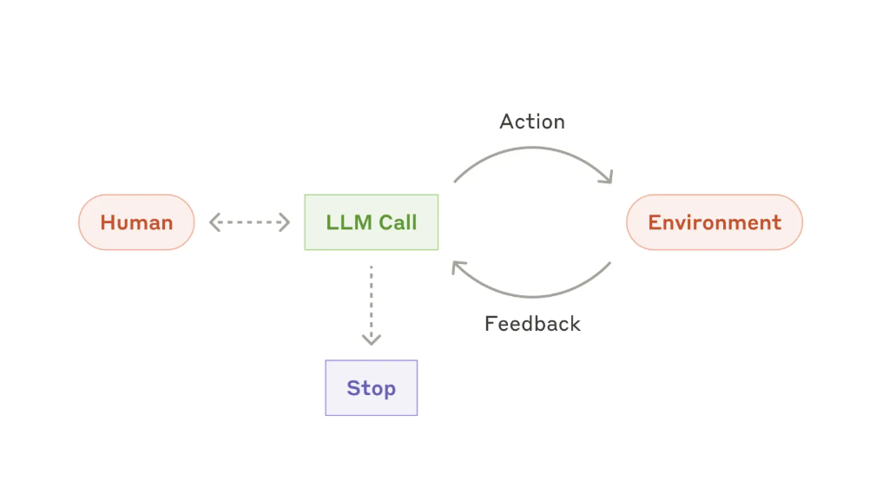
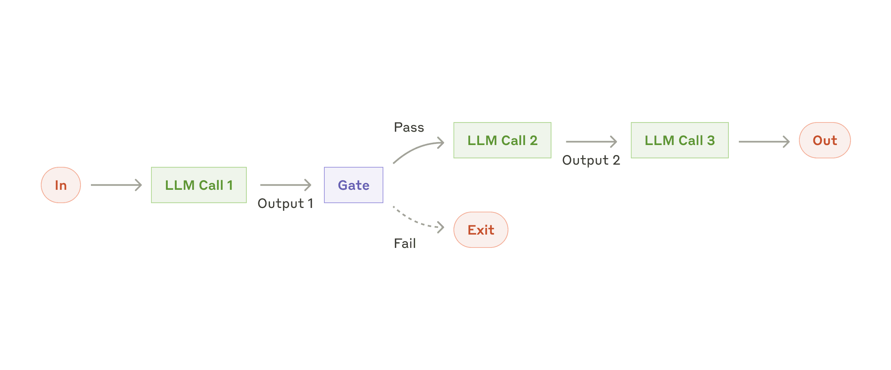

# llm-design-patterns

- https://www.anthropic.com/engineering/building-effective-agents
- https://www.philschmid.de/agentic-pattern

| Contents                 |
|--------------------------|
| [Autonomous Agent](#autonomous-agent) |
| [Computer Use](#computer-use) |
| [Evaluator Optimiser (Reflection)](#evaluator-optimiser-reflection) |
| [Memory](#memory) | 
| [Multimodal Input/Output](#multimodal-inputoutput) |
| [Orchestrator and Workers](#orchestrator-and-workers) |
| [Parallel Processing](#parallel-processing) |
| [Prompt Chaining](#prompt-chaining) |
| [Retrieval-Augmented Generation (RAG)](#retrieval-augmented-generation-rag) |
| [Routing](#routing) |
| [Tool Use (function-calling)](#tool-use-function-calling) |

## Autonomous Agent



TODO: [ReAct agent](https://arxiv.org/abs/2210.03629)

- [Large Language Model Agent: A Survey on Methodology, Applications and Challenges](https://arxiv.org/abs/2503.21460)

## Computer Use

## Evaluator Optimiser (Reflection)

## Memory

Large Language Models are stateless, meaning that any information/history persisted between one generation and the next must be persisted manually by us.

The most straightforward way to do this is to keep a full history of the conversation so far by continually dumping the full chat history into the input prompt. However, this soon either:

1. Exceeds the context window of the model

2. Causes a drastic reduction in output quality as the model starts to forget things in the middle of the prompt ([Lost in the Middle](https://arxiv.org/abs/2307.03172))

There are various different approaches to manual memory management. Here is very non-exhaustive list of options (this remains an area of active research):

| Approach       | Description                    |
|----------------|--------------------------------|
| Sliding window | Only keep the last X most recent messages (or tokens) and include these in the input prompt each time|
| Periodic Summarisation | Every time the chat history gets X messages (or tokens) long, reduce it's size by using the LLM to summarise it (could be summarised at every step). Include the summarised history in the input prompt each time |
| External messages store | Store the conversation history in an external system (e.g. vector database) and fetch the most relevant messages each time (insert them into the input prompt). There are many ways to measure relevance (vector similarity, recency, LLM-assigned memory importance rating) |
| Hybrid | Any combination of the previously mentioned memory approaches (e.g. both a sliding window of most recent messages and an external vector database containing long-term memories) | 

## MultiModal Input/Output

```bash
# example of including an image in the prompt:
uv run python -m multimodal.image_input
```

## Orchestrator and Workers

## Parallel Processing

There are a few different ways to run code in parallel/concurrently. Examples are multi-core, multi-thread, async and greenlets (not an exhaustive list). There are different tradeoffs associated with each. Here is an example using the async OpenAI client (over 100 chat completions, I measured this approach to be 32x faster than synchronous API calls in a simple for loop):

```bash
uv run python parallel_processing/async.py
```

## Prompt Chaining

*Prompt Chaining* refers to sequential LLM calls, where the output of one feeds into the prompt of the next.



Here is a simple 2-step example:
```bash
uv run python -m prompt_chaining.step_back_prompting_example
```

## Retrieval-Augmented Generation (RAG)

## Routing

## Tool Use (function-calling)

```bash
uv run python -m tool_use.function_calling
```

