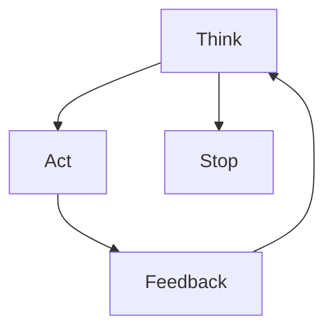

# llm-design-patterns

The famous 1994 software engineering book [Design Patterns: Elements of Reusable Object-Oriented Software](https://en.wikipedia.org/wiki/Design_Patterns) popularised the idea of identifying reusable solutions for solving commonly occurring problems in software development. Another core facet of this approach was giving software developers a shared vocabulary which they could use to better communicate about their code. Examples of popular patterns include the [strategy pattern](https://en.wikipedia.org/wiki/Strategy_pattern), [factory method pattern](https://en.wikipedia.org/wiki/Factory_method_pattern), [singleton pattern](https://en.wikipedia.org/wiki/Singleton_pattern), [observer pattern](https://en.wikipedia.org/wiki/Observer_pattern) and the [decorator pattern](https://en.wikipedia.org/wiki/Decorator_pattern).

This repo contains various reusable patterns which I've collected which are applicable to generative Large Language Model-based applications. It's actually a mixture of design patterns and useful code snippets.

My main sources have been:

1. https://www.anthropic.com/engineering/building-effective-agents

2. https://github.com/humanlayer/12-factor-agents

3. https://huggingface.co/blog/smolagents

4. https://www.philschmid.de/agentic-pattern

Throughout this repo, I usually refer to Large Language Models as *LLM*s.

The most fundamental rule for using LLMs effectively is *make their scope as narrow as possible*. The more agency you give to a LLM, the more failure modes you introduce into your application. For parts of your program which can be solved without an LLM, do not use an LLM (LLMs are slow, stochastic and expensive - and they always will be).

| Contents                 |
|--------------------------|
| [Autonomous Agent](#autonomous-agent) |
| [Computer Use](#computer-use) |
| [Evaluator Optimiser (Reflection)](#evaluator-optimiser-reflection) |
| [LLM Client](#llm-client) |
| [Memory](#memory) | 
| [Multimodal Input/Output](#multimodal-inputoutput) |
| [Orchestrator and Workers](#orchestrator-and-workers) |
| [Parallel Processing](#parallel-processing) |
| [Prompt Chaining](#prompt-chaining) |
| [Retrieval-Augmented Generation (RAG)](#retrieval-augmented-generation-rag) |
| [Routing](#routing) |
| [Structured Outputs](#structured-outputs) |
| [Tool Use (function-calling)](#tool-use-function-calling) |
| [Other Useful Resources](#other-useful-resources) |

## Autonomous Agent

There are many definitions of [LLM agent](#autonomous-agent), but the definition which is useful to me is a LLM *which has the ability to direct the control flow of the program*. The [anthropic "Building Effective Agents" blog](https://www.anthropic.com/engineering/building-effective-agents) differentiates this from a *workflow*, which is a software program with a predetermined execution path (control flow) that contains LLMs within it.

*Agency* can also be considered along a spectrum. I this table from the [smolagents blog](https://huggingface.co/blog/smolagents):

| Agency Level | Description                                               | How that's called   | Example Pattern                                                |
|--------------|-----------------------------------------------------------|---------------------|----------------------------------------------------------------|
| ☆☆☆☆          | LLM output has no impact on program flow                  | Simple processor    | `process_llm_output(llm_response)`                             |
| ★☆☆☆          | LLM output determines basic control flow                  | Router              | `if llm_decision(): path_a() else: path_b()`                   |
| ★★☆☆          | LLM output determines function execution                  | Tool call           | `run_function(llm_chosen_tool, llm_chosen_args)`               |
| ★★★☆          | LLM output controls iteration and program continuation    | Multi-step Agent    | `while llm_should_continue(): execute_next_step()`             |
| ★★★★          | One agentic workflow can start another agentic workflow  | Multi-Agent         | `if llm_trigger(): execute_agent()`                            |
**Source: https://huggingface.co/blog/smolagents**

Agent implementations typically alternate between [tool calling](#tool-use-function-calling) (taking actions in a system) and observing the effect of those actions, continuing like this in a loop until they themselves decide to stop, or until a termination condition is reached (e.g. a predetermined cost or time threshold).


**source: https://www.anthropic.com/engineering/building-effective-agents**

A [ReAct agent](https://arxiv.org/abs/2210.03629) (REason + ACT) is very similar, but has an additional *think* (explicit planning) step:



An alternative to [tool use](#tool-use-function-calling) is to allow the agent to interact with a system through writing code (see [Executable Code Actions Elicit Better LLM Agents](https://arxiv.org/abs/2402.01030). This is the approach implemented by the [smolagents](https://github.com/huggingface/smolagents) python framework.

Since agents are by nature multi-step, one cannot build an agent without considering agent [memory](#memory).

## Computer Use

There is ongoing research and innovation in the pursuit of using MultiModal LLMs to control computers directly (i.e. use computer vision on the actual GUI, and interact via keyboard and mouse instructions).  

I haven't explored this area much, but here are some python libraries which I am aware of:

- https://github.com/browser-use/browser-use (LLM can navigate freely in your local web browser)

## Evaluator Optimiser (Reflection)

TODO

## LLM Client

Example of a cost-tracking wrapper around the OpenAI API client:

```bash
uv run python llm_client/cost_tracking_llm_client.py
```

## Memory

Large Language Models are stateless, meaning that any information/history persisted between one generation and the next must be persisted manually by us.

The most straightforward way to do this is to keep a full history of the conversation so far by continually dumping the full chat history into the input prompt. However, this soon either:

1. Exceeds the context window of the model

2. Causes a drastic reduction in output quality as the model starts to forget things in the middle of the prompt ([Lost in the Middle](https://arxiv.org/abs/2307.03172))

There are various different approaches to manual memory management. Here is very non-exhaustive list of options (this remains an area of active research):

| Approach       | Description                    |
|----------------|--------------------------------|
| Sliding window | Only keep the last X most recent messages (or tokens) and include these in the input prompt each time|.
| Periodic Summarisation | Every time the chat history gets X messages (or tokens) long, reduce it's size by using the LLM to summarise it (could be summarised at every step). Include the summarised history in the input prompt each time |
| External messages store | Store the conversation history in an external system (e.g. vector database) and fetch the most relevant messages each time (insert them into the input prompt). There are many ways to measure relevance (vector similarity, recency, LLM-assigned memory importance rating) |
| Hybrid | Any combination of the previously mentioned memory approaches (e.g. both a sliding window of most recent messages and an external vector database containing long-term memories) | 

Another approach which I've found to be highly effective is to design the user/LLM application interface specifically around NOT USING MEMORY i.e. make the chatbot "1-shot", and if the user wants something slightly different they can just modify their input prompt and have another go on a fresh LLM.

## MultiModal Input/Output

```bash
# example of including an image in the prompt:
uv run python -m multimodal.image_input
```

## Orchestrator and Workers

TODO

## Parallel Processing

There are a few different ways to run code in parallel/concurrently. Examples are multi-core, multi-thread, async and greenlets (not an exhaustive list). There are different tradeoffs associated with each. Here is an example using the async OpenAI client (over 100 chat completions, I measured this approach to be 32x faster than synchronous API calls in a simple for loop):

```bash
uv run python -m parallel_processing.async
```

## Prompt Chaining

*Prompt Chaining* refers to sequential LLM calls, where the output of one feeds into the prompt of the next.


Here is a simple 2-step example:
```bash
uv run python -m prompt_chaining.step_back_prompting_example
```

## Retrieval-Augmented Generation (RAG)

```bash
uv run streamlit run rag/chonkie_visualiser_app.py
```

## Routing

TODO

## Structured Outputs

*Structured Outputs* refers to getting the LLM to return data with a specific structure/schema. LLMs, by their very nature, return unstructured text.

This typically means returning JSON with a specific structure (and data types).

The best way to do this (in my opinion) is to use [Outlines](https://github.com/dottxt-ai/outlines) (or a similar framework), which restricts output at the TOKEN level i.e. every time the LLM generates a token, we control the subset of tokens which it can choose from. This gives us a lot of power since we can make the output conform to any arbitrary structure we like (e.g. even a regex pattern). This is only possible with open models (where we have access to the logits).

When using a closed-source model (no access to logits), one must use this approach:

TODO

Here is my implementation (I learned about this from [instructor](https://github.com/567-labs/instructor)):

```bash
uv run python -m structured_outputs.pydantic_schema_dump_retry
```

## Tool Use (function-calling)

```bash
uv run python -m tool_use.function_calling
```

## Other Useful Resources

- [Large Language Model Agent: A Survey on Methodology, Applications and Challenges](https://arxiv.org/abs/2503.21460)
