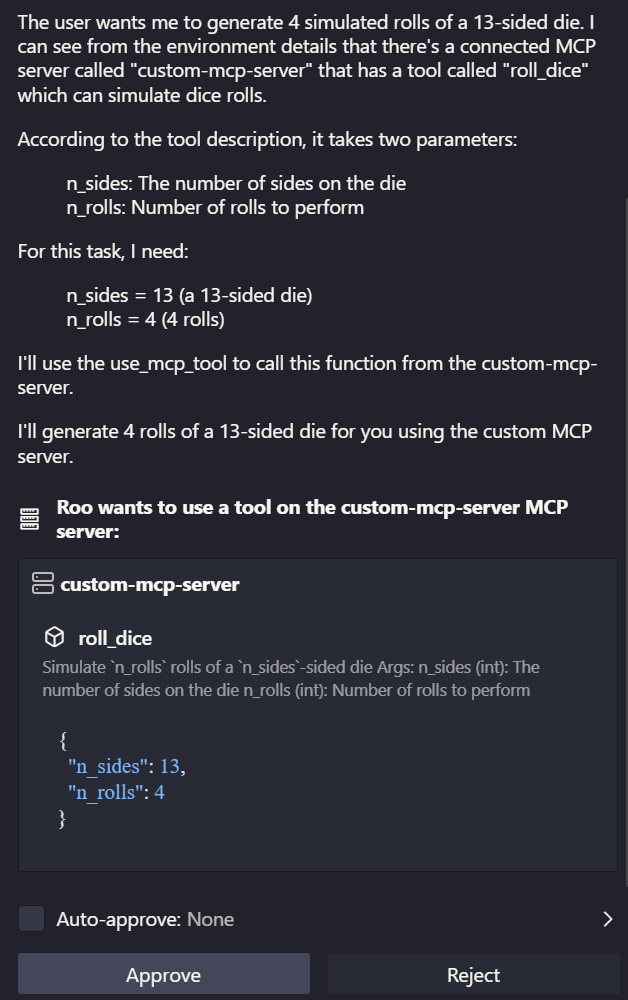

# Custom MCP Server

This folder contains a custom [Model Context Protocol (MCP)](https://modelcontextprotocol.io/introduction) server (structured as a python package).

This README.md shows how to enable the Large Language Model agent in your IDE (or any other MCP-compatible client) to use the python functions (*tools*) defined in this server.



You can experiment with the tools in a local web app by running:

| linux            | windows 
|------------------|-------------
| `cd llm-design-patterns/model_context_protocol/custom_mcp_server` | `cd .\llm-design-patterns\model_context_protocol\custom_mcp_server` |
| `uv run mcp dev src/custom_mcp_server/main.py` | `uv run mcp dev .\src\custom_mcp_server\main.py` |

## Make this MCP server available to roo code in vs-code (or any other MCP-compatible IDE/platform):

| step            | platform         | command
|-----------------|------------------|----------------------------
| Navigate to custom MCP server project dir | linux/macos | `cd llm-design-patterns/model_context_protocol/custom_mcp_server`
| | windows | `cd .\llm-design-patterns\model_context_protocol\custom_mcp_server`
| Build custom MCP server into a binary python package file (.whl) | linux/macos/windows | `uv build`
| Copy the package .whl file to somewhere | linux/macos | `mkdir -p ~/.mcp_servers/custom_mcp_server/dist`
| |  | `cp ./dist/custom_mcp_server-X.X.X-py3-none-any.whl ~/.mcp_servers/custom_mcp_server/dist`
| | windows | `New-Item -ItemType Directory -Force -Path $env:USERPROFILE\.mcp_servers\custom_mcp_server\dist`
| | | `Copy-Item .\dist\custom_mcp_server-X.X.X-py3-none-any.whl -Destination $env:USERPROFILE\.mcp_servers\custom_mcp_server\dist`
| Install the package | linux/macos | `cd ~/.mcp_servers/custom_mcp_server`
|                     | | `uv run --no-project --python 3.13 python -m venv .venv` (target specific python installation) **OR** `python -m venv .venv` (use system python)
|                     | | `source .venv/bin/activate` 
|                     | | `pip install ./dist/custom_mcp_server-X.X.X-py3-none-any.whl`
|                     | windows     | `cd $env:USERPROFILE\.mcp_servers\custom_mcp_server` 
|                     | | `uv run --no-project --python 3.13 python -m venv .venv` (target specific python installation) **OR** `python -m venv .venv` (use system python)
|                     | | `.venv\Scripts\Activate.ps1`
|                     | | `pip install .\dist\custom_mcp_server-X.X.X-py3-none-any.whl`

Now add our custom MCP server to your existing MCP config in roo code in vs-code (or cursor or claude desktop or other IDE or MCP client software):

for linux/macos: 
```json
{
  "mcpServers": {
    "custom-mcp-server": {
      "command": "bash",
      "args": [
        "-c",
        "cd ~/.mcp_servers/custom_mcp_server && source .venv/bin/activate && custom-mcp-server"
      ]
    }
  }
}
```

for windows:
```json
{
  "mcpServers": {
    "custom-mcp-server": {
      "command": "cmd",
      "args": [
        "/c",
        "cd %USERPROFILE%\\.mcp_servers\\custom_mcp_server && call .venv\\Scripts\\activate && custom-mcp-server"
      ]
    }
  }
}
```
